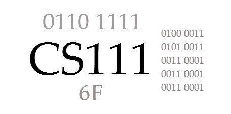

# CS 111 Introduction to Computer Science   
**Summer 2026**
**Section X1 - Online**   

---

## Instructor Information

**Instructor:** Dr. Jeff Lehman  

See contact information on Moodle.

> **Privacy Note:**  
> Instructor contact information is not listed in this public syllabus to reduce spam and protect privacy.  
> All enrolled students can find current contact details and office hours on Moodle.

---

## Meeting Time & Location

Course is **asynchronous** with most assignments are due at the start of the following week (Monday) to give flexibility for summer travel/work schedules.  

---

## Course Description

An introduction to fundamental computer concepts and terminology applicable for communication in 
today’s world. Topics include historical perspective, computer architecture, operating systems, 
networking, impact of computing on society and current application areas, including spreadsheets, 
web page development and use of a programming language. Programming topics include input/output, 
loops, decision structures, arrays and methods. Attention is given to good programming style and 
problem-solving techniques for program design, coding, documentation, debugging and testing. *(3 credit hours; fall/spring/summer)*

This course integrates computing concepts and Python programming to build data-focused problem-solving skills for data analytics, prepare students for future coding courses, and provide practical Python literacy for all majors.

---

## Learning Outcomes

Students will be able to:

1. Demonstrate an understanding of fundamental computer concepts, including historical perspectives, binary and hexadecimal numbers, computer architecture, operating systems, networking and the Internet, and artificial intelligence, enabling them to engage with today’s digital world effectively.
2. Develop practical skills in application areas such as spreadsheets, web page development, and programming languages.
3. Design, implement, and document simple programs using basic programming constructs, including input/output operations, loops, decision structures, arrays, and methods.
4. Implement algorithms and apply problem-solving techniques, focusing on good programming style while performing effective debugging and testing to ensure code clarity and functionality.
5. Identify current ethical issues related to technology and the impact of computing on society, exploring how Christian values and Biblical insights apply.

---

## Required Texts and Resources

All required texts and readings are **free and open-source**. Check the course website for weekly readings and links.

- (Free online textbook) ***Welcome to CS*** by Andrew Scholer  
  <https://runestone.academy/ns/books/published/welcomecs2/welcomecs.html?mode=browsing>

- (Website) **W3Schools**  
  <https://www.w3schools.com/>

- (Website) **Geeks for Geeks**  
  <https://www.geeksforgeeks.org/>

- (Optional print book)
  ***Computer Science Illuminated*** by Nell Dale and John Lewis (7th edition recommended; any edition acceptable). *Note: Most students find the online text, websites, and instructor materials sufficient. This book is helpful for topics on Exam #1 and Exam #2.*

---

## Grading

Each course component is worth a specific number of points. The percentage of total points determines the final grade. The instructor reserves the right to adjust assignments and points while maintaining overall percentage weightings.

| Component                         | Points | Percent |
|-----------------------------------|--------|---------|
| Course Engagement                 | 75     | 7.5%      |
| Weekly Assignments (x13)          | 350    | 37.5%     |
| Review Question Sets (x3)         | 50     | 5%      |
| Exams #1 & #2                     | 300    | 30%     |
| Exam #3 (final)                   | 200    | 20%     |
| **Total**                         | **1000** | **100%** |

### Grading Scale

- **A:** 93.0+  
- **A-:** 90.0–92.9  
- **B+:** 88.0–89.9  
- **B:** 83.0–87.9  
- **B-:** 80.0–82.9  
- **C+:** 78.0–79.9  
- **C:** 73.0–77.9  
- **C-:** 70.0–72.9  
- **D+:** 68.0–69.9  
- **D:** 63.0–67.9  
- **D-:** 60.0–62.9  
- **F:** 0–59.9  

---

## Course Engagement and Discussions (8%)

Active Course Engagement is vital for success in this course. Weekly readings and videos present the course material and provide the background needed to complete assignments and prepare for exams. Students are responsible for reading all assigned materials and viewing course videos.

Students are encouraged to take notes summarizing topics covered in readings, videos, and class sessions, and to send questions via email or text when clarification is needed.

**Course Engagement grades** are recorded after each exam:
- 20 points after Exam #1  
- 20 points after Exam #2  
- 35 points after Exam #3  

Scores are based on:
- Completion and quality of weekly assignments  
- Timely and complete discussion posts  
- Communication with the instructor (such as asking questions or sharing insights)  
- Participation self-reflection  

**Course Engagement is not a single assignment but a cumulative assessment of participation and engagement over time.**

### Discussion Questions

Most weeks include one or two required **Discussion Questions** in a Moodle discussion forums.questions related to the week topics.

Posts should demonstrate:
- Critical thinking  
- Original perspectives  
- Engagement with course topics  

Some weeks may require a **second post**, although most weeks only require answering the assigned questions. Students are encouraged (but not required) to respond to classmates, ask questions, share insights, and provide links to relevant or related information.

All discussion interactions must remain respectful and appropriate.

**AI Policy for Discussions:**  
Discussion posts must be your own work. **Do not use AI tools to write your discussion responses.** These posts are intended to reflect your personal understanding and engagement with the material.

Completion of discussion questions contributes to the **Course Engagement grade**. **Timely posts are required to receive credit. Late discussion posts do not receive credit.**

---

## Weekly Assignments (38%)

Weekly Assignments are a central part of **Course Engagement** in this course. They are designed to help you practice new concepts, apply what you are learning, and reflect on your progress throughout the semester.

Weekly assignments help students apply and integrate concepts discussed in the text, online resources, and class sessions (in-person). The material covered in these assignments will assist students in preparing for exams and projects. Students should ensure that all submitted work is neat, organized, and clearly labeled with their first and last name. Assignments should be submitted through Moodle unless otherwise instructed.

Success in this course depends on steady participation and consistent effort rather than last-minute work. Weekly assignments are intended to be worked on throughout the week as part of regular course engagement.

---

## Late Policy

This 3-credit course moves quickly, covering the same material as a 15-week course in a shortened summer term. **Staying on schedule is essential.**

Unless otherwise noted, **all coursework is due on Mondays at 11:59 pm Indiana (Eastern) Time**.

Students are encouraged to start early in the week and ask questions as needed. The instructor will try to respond within 24 hours on weekdays (usually more quickly). Questions asked late at night or over the weekend may be answered the next business day.

Each week’s materials will open on **Friday of the previous week**, providing 10-11 days including two weekends to complete the work.

- **Assignments:** Late work is accepted up to **48 hours after the deadline** with a **10% penalty per assignment**, unless otherwise noted. Given the compressed schedule, extensions are granted only for extreme hardship (see below). **Assignments submitted more than 48 hours late are not eligible for credit.**
- **Discussion Posts:** Must be submitted on time. **Late discussion posts do not receive credit.**
- **Exams:** Must be completed by the posted deadline. **Late exams are not accepted** unless prior arrangements are made with the instructor.
- Assignments must be submitted through Moodle unless otherwise instructed.
- In cases of extreme hardship or documented circumstances, students should notify the instructor as soon as possible.
- Grades will be posted in Moodle. Students are responsible for reviewing their grades and reporting discrepancies promptly.

## Review Question Sets (5%)

Review questions will be posted for each topic to help reinforce your understanding of the material. These questions are similar to those you will encounter on exams. You are encouraged to work through them until you answer all questions correctly. Although they are listed as a 'Quiz' in Moodle, you can submit your answers multiple times, with your highest score being recorded. The review questions are open-book.

---

### Programming Tools

- **Python 3** will be used for coding assignments.
- **Thonny IDE** (recommended offline editor): <https://thonny.org/>  
- **Google Colab** (Python examples): <https://colab.google/>  
- **GitHub** (hosting web pages): <https://github.com/>

---

## Academic Honesty and Plagiarism

Integrity is essential. Plagiarism includes submitting work that is not your own, copying answers, failing to cite sources, using AI when prohibited, or treating individual assignments as group work.

Consequences may include a failing assignment grade, failure of the course, and referral to the Academic Dean.

Plagiarism is using another’s ideas, information, or wording without proper acknowledgment. All quoted, paraphrased, or summarized material must be cited. Common knowledge is the only exception.

---

## AI Statement

This course permits AI tools (e.g., ChatGPT, Google Gemini, Microsoft Copilot, Grammarly) to assist with learning and development.

Students may use AI to:
- Understand concepts  
- Receive feedback on writing  
- Debug code  
- Generate practice problems  

Students must understand and be able to explain all submitted work. AI tools are **not allowed on exams**.

Assignments will include AI usage guidelines:  
- **Red:** No AI use  
- **Yellow:** Limited / cautious AI use    
- **Green:** AI freely allowed  
 

Improper AI use is considered cheating and/or plagiarism.

---

## Disability and Accessibility Policy

In compliance with Section 504 and the ADA, Huntington University provides reasonable accommodations.

Contact the **Academic Center for Excellence (ACE)**:  
- Phone: 260-359-4290  
- Email: ace@huntington.edu  

Faculty will work with ACE to support eligible students.

---

## Schedule and Exams

Exams are **closed notes**. Review topics and sample questions are provided. Exams #1 and #2 are online and require Respondus browser and a web camera. 

- **Exam #1: Week #3 (On-line via Respondus Browser)**
- **Exam #2: Week #5 (On-line via Respondus Browser)**
- **Exam #3 (Final): Week #7 (On-line via Respondus Browser)**

> The schedule may change slightly. Check the course website for updates.

### Weekly Schedule

| Week # | Dates | Topics                                                                 | Assignments Due |
|------|-------|------------------------------------------------------------------------|------|
| 1    | 5/4 - 5/10  | Welcome, History, Binary, Hex                                          | 5/11 |
| 2    | 5/11 - 5/17 | ASCII, Compression, Logic, Hardware                                    | 5/18 |
| 3    | 5/18 - 5/24 | **Exam #1**, Operating Systems/Files, Cloud Apps, Spreadsheets | 5/25 |
| 4    | 5/25 - 5/31 | Networking, Web (HTML, CSS), Security, AI                              | 6/1  |
| 5    | 6/1 - 6/7   | **Exam #2**,  Programming (Python), Planning (IPO), Input/Output | 6/8  |
| 6    | 6/8 - 6/14  | Ethical Issues, Selection (if),                                      | 6/15 |
| 7    | 6/15 - 6/21 | Repetition (loops), Lists, **Exam #3 (final)**                                              | 6/22 |

-- end --
