# Security Overview

*CS 111 – Introduction to Computer Science*  
Dr. Jeff Lehman  
Huntington University

---

# What Can Go Wrong?

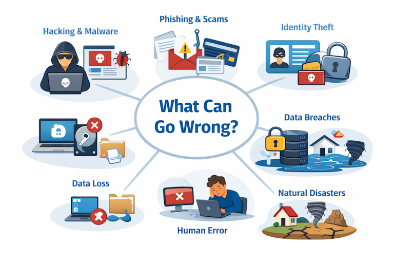

Computer systems can fail or lose data for many reasons.

Common causes include:

- **Human Error**
  - Accidental deletion of files
  - Incorrect configuration
- **Electricity Problems**
  - Power outages
  - Power surges
- **Hardware Failure**
  - Hard drive crashes
  - Component wear
  - MTBF — *Mean Time Between Failures*
- **Natural Disasters**
  - Fire
  - Flood
  - Tornado
- **Software Failure**
  - Bugs or crashes
- **Malicious Software**
  - Viruses
  - Spyware
  - Ransomware

---

# Computer Viruses

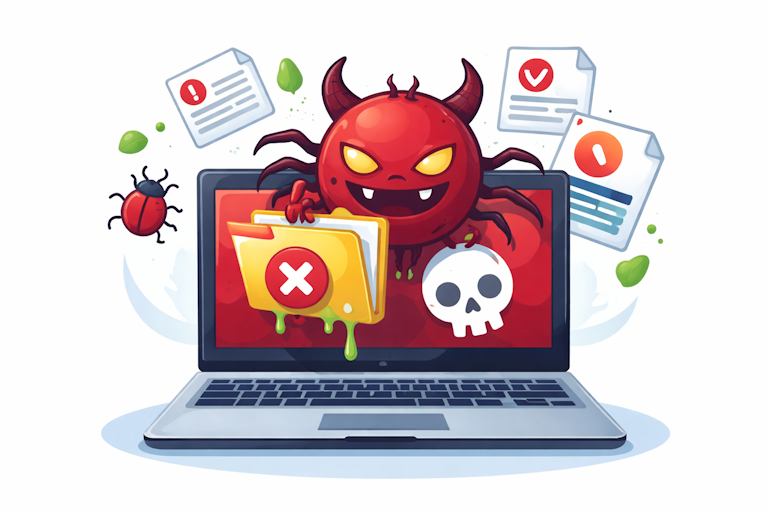

A **computer virus** is a malicious program that:

- Destroys or alters data or programs
- Causes system problems or annoyance
- **Replicates itself**
- Requires a **host file or program**
- Is intentionally created by humans

### Why Are Viruses Created?

Common motivations include:

- Power
- Prestige
- Thrill

---

# Types of Viruses

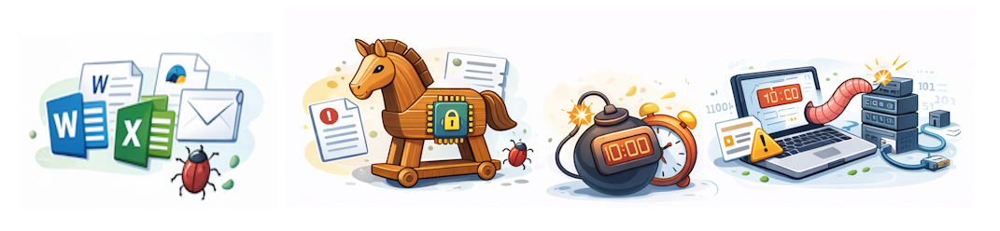

### Macro Virus

Uses commands inside applications such as:

- Microsoft Word
- Excel
- Outlook

---

### Trojan Horse

A program that **pretends to be legitimate software** but performs hidden malicious actions.

---

### Time Bomb

Malicious code that activates at a **specific date or time**.

---

### Worm

A self-replicating program that spreads through networks **without needing a host program**.

---

# Virus Protection

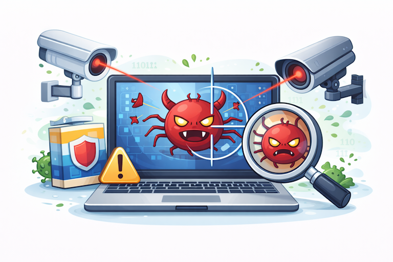

### Anti-Virus Software

Examples include:

- Norton
- Sophos (available for free as HU student)
- AVG
- Avast
- McAfee

These programs:

- Detect malware
- Remove malicious programs
- Monitor suspicious activity

---

### Safe Email Practices

Be cautious when opening email attachments.

Always:

- Know the **sender**
- Know the **content**
- Avoid unexpected attachments

---

# Spyware, Adware, and Malware


### Spyware

Software that secretly **collects personal data** about users.

Examples:

- Browsing habits
- Passwords
- Personal information

---

### Adware

Software that **displays advertisements** on a computer.

Often bundled with free software.

---

### Malware

A general term for **malicious software** that disrupts or damages a system.

---

# Anti-Spyware Tools

Programs designed specifically to remove spyware.

Examples include:

- Ad-Aware
- SpyBot Search & Destroy
- CCleaner

Many modern antivirus programs include **anti-spyware protection**.

### Safety Tip

Be cautious of **free software downloads**.

They may install unwanted programs.

---

# Ransomware

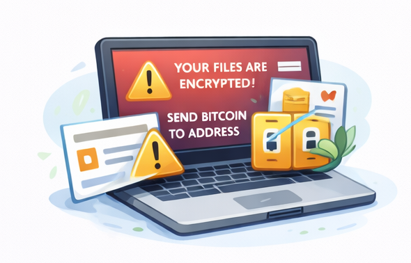

**Ransomware** encrypts files on a computer or network.

Attackers demand **payment (a ransom)** to:

- Restore access to files
- Prevent data from being publicly released

Ransomware attacks often target:

- Businesses
- Hospitals
- Government systems
- Universities

---

# Phishing and Hoaxes

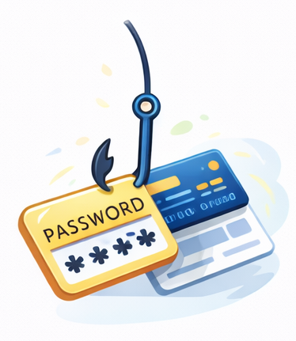

### Phishing

An attempt to steal personal information using **fake emails or websites**.

These messages often look like they come from:

- Banks
- PayPal
- Amazon
- Universities

---

### Hoax Emails

Messages that appear believable but are **false**.

They often encourage users to:

- Forward the message
- Click suspicious links
- Provide personal information

---

### Best Practice

Before responding:

- Verify the message
- Check the sender
- Do not reply to suspicious emails

---

# Risk Management

Security decisions (policies, procedures, investments, etc..) must reflect the **value of the data being protected**.

Example:

| Data Type | Security Needed |
|-----------|----------------|
| Homework files | Low |
| Personal photos | Medium |
| Financial data | High |
| Company customer database | Very High |


---

# Security Measures

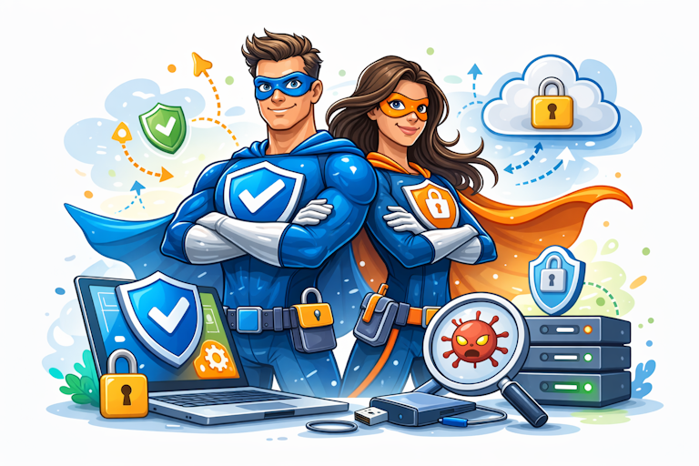

Common ways to protect systems include:

### Physical Security

- Locked rooms
- Secure server locations

---

### Authentication

- Passwords
- User IDs
- Biometrics (fingerprint, face recognition)

---

### Access Control

Restrict who can access systems or data.

Examples:

- Administrator privileges
- File permissions

---

### Encryption

- Protects data by converting it into unreadable form.
- Only authorized users can decrypt it.
- Look for web sites with http*s*://

---

### Hardware Redundancy

Extra hardware components provide backup if one fails.

Example:

- RAID storage systems

---

### Backups

Copies of important data stored separately from the original.

---

### Disaster Recovery Plans

Procedures to restore systems after a failure or disaster.

---

# Password Best Practices

Strong passwords should:

- Avoid dictionary words
- Include **upper and lower case letters**
- Include **symbols or numbers**
- Be **longer**

Long passwords are much harder to crack.

---

### Password Managers

Tools that securely store passwords.

Examples:

- LastPass
- 1Password
- KeePass
- Dashlane

These allow users to maintain **unique passwords for each account**.

---

# XKCD Password Example


A long passphrase can be easier to remember and harder to guess.

Example:

```

correct horse battery staple

```

This type of password is **hard for computers to guess** but easy for people to remember. Add upper/lower case letters and special characters to increase complexity.

---

# Two-Factor Authentication (2FA)

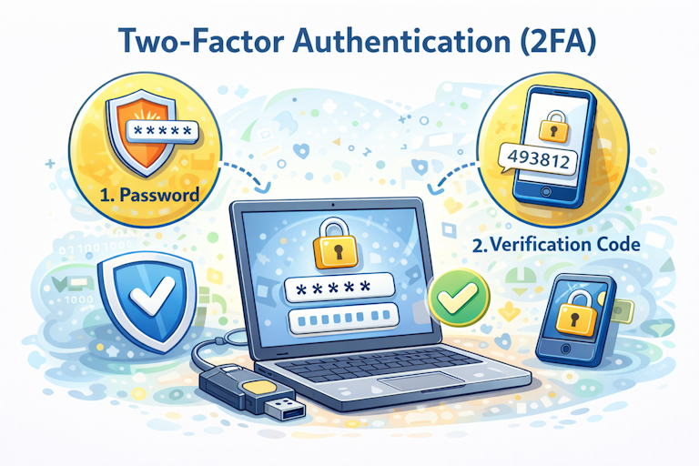

**Two-Factor Authentication (2FA)** adds an additional layer of security when logging into an account.

Instead of requiring **only a password**, the system requires **two different forms of verification**.

This greatly reduces the risk of unauthorized access.

---

## The Three Types of Authentication

Authentication methods generally fall into three categories.

### Something You Know

Information only the user should know.

Examples:

* Password
* PIN
* Security questions

---

### Something You Have

A physical device that belongs to the user.

Examples:

* Smartphone
* Security token
* Smart card
* USB security key

---

### Something You Are

A **biometric characteristic** of the user.

Examples:

* Fingerprint
* Face recognition
* Voice recognition
* Eye (retina or iris scan)

---

# Two-Factor Authentication in Practice

Most systems combine **two different authentication categories**.

Example login process:

1. Enter your **password**
2. Enter a **verification code** sent to your phone

Even if someone steals your password, they **cannot log in without the second factor**.

---

# Common 2FA Methods

### Text Message Codes (SMS)

A one-time code is sent to your phone.

Example:

```
Your verification code is: 493812
```

You must enter this code to complete login.

---

### Authenticator Apps

Applications generate temporary login codes.

Examples:

* Microsoft Authenticator
* Google Authenticator
* Authy
* Duo

Codes usually **change every 30 seconds**.

---

### Hardware Security Keys

Physical devices used for authentication.

Examples:

* USB security key
* Smart card

The user must **insert or tap the device** to complete login.

These are commonly used in **high-security environments**.

---

# Why Two-Factor Authentication Matters

Passwords can be stolen through:

* Phishing attacks
* Malware
* Data breaches
* Password reuse

Two-Factor Authentication provides **additional protection**.

Even if attackers obtain a password, they **cannot access the account without the second factor**.

---

# Best Practice

Whenever possible:

* Enable **Two-Factor Authentication**
* Use **Authenticator Apps** instead of SMS when available
* Protect your phone or security key

Two-Factor Authentication is one of the **most effective security protections available**.

---

# Backup Planning

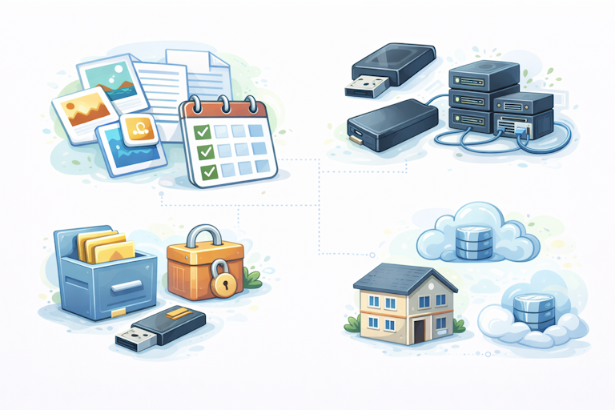

A good backup plan should answer several questions.

### What files should be backed up?

- Documents
- Photos
- Programs
- Settings

---
### How much data do I have?

- Estimate storage requirments in MB or GB (maybe TB)
- Look at amount of data generated in a month and multipley by x12

---

### When should backups occur?

- Daily
- Weekly
- Monthly

---

### Where should backups be stored?

Examples:

- USB drive
- External hard drive
- Network storage
- Cloud storage

---

### Where should backup media be kept?

Possible locations include:

- File drawer
- Lockbox
- Another building
- Cloud storage

---

# Types of Backups

There are three common backup methods.

---

## Full Backup


A **full backup** copies all files every time.

Advantages:

- Simple restore process

Disadvantages:

- Requires large storage space
- Takes longer to complete

---

## Differential Backup


Copies **all files changed since the last full backup**.

Advantages:

- Faster than full backup
- Restore requires only two backups

---

## Incremental Backup


Copies **files changed since the last backup**.

Advantages:

- Very fast backups
- Requires minimal storage

Disadvantages:

- Restoring requires multiple backup sets

---

# Cloud Backups

Cloud storage services often use **incremental backups**.

Examples include:

- iCloud
- Dropbox
- OneDrive
- Google Drive

Process:

1. Initial **full backup**
2. Only **changes** are uploaded afterward

This allows systems to **roll back to earlier versions**.

---

# The 3-2-1 Backup Strategy

A widely recommended rule for backups.

### 3 Copies of Data

- Original file
- Two backup copies

---

### 2 Local Copies

Stored on different media.

Example:

- Laptop
- External drive

---

### 1 Off-Site Copy

Stored at another location.

Examples:

- Cloud storage
- Office server
- Family member’s house

---

# The 3-2-1-1-0 Backup Strategy

An improved version of the 3-2-1 rule.

Adds:

- **1 Offline Backup**
  - Protects against ransomware
- **0 Backup Errors**
  - Verify backups regularly

---

# Cloud Storage Example: OneDrive

Huntington University students receive:

**5 TB of free cloud storage**

To access:

1. Login to HU email
2. Open the Office 365 app launcher
3. Select **OneDrive**

See [OneDrive](https://www.microsoft.com/en-us/microsoft-365/onedrive/free-online-cloud-storage) 
---

# Disaster Recovery

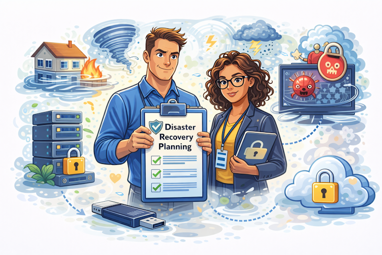

A **disaster recovery plan** describes how an organization restores systems after a disaster.

Possible disasters include:

- Cyberattacks
- Hardware failures
- Fires
- Floods
- Power outages

A recovery plan may include:

- Data restoration procedures
- Backup systems
- Emergency contacts
- System restoration steps

---

# Final Question

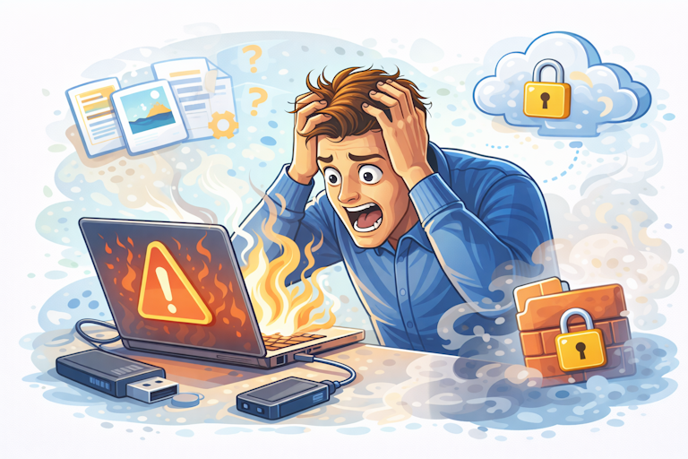

**What is your disaster recovery plan?**

Every organization and every individual should have one.


-- end --
